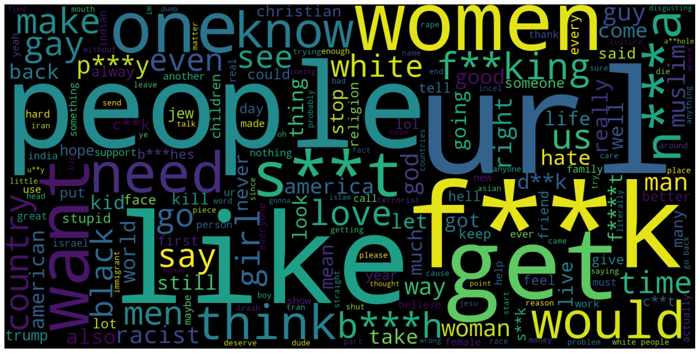
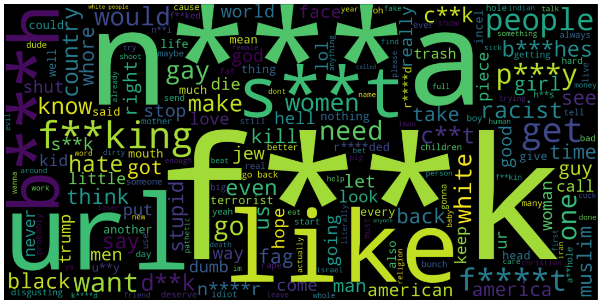
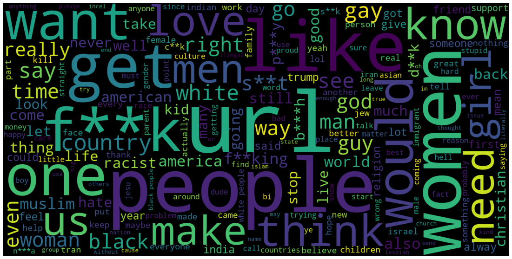

# BERT-Fine-Tuning-Hate-Speech-Detection

Reference Paper : https://arxiv.org/pdf/1910.12574.pdf

Contributors:

* Badr Jaidi

* Oksana Kurylo

* Sneha Jhaveri

* Utkarsh Saboo

### Introduction

#### Aim

This project's aim is to train a general social media hate-speech classifier and compare multiple models for hate-speech detection. We trained these models on raw (social media) text to classify it between two classes hate_speech and not-hate-speech. 

We use multiple flavours of BERT, such as BERTweet, DistilBERT, BERT Base and RoBERTa, and adapt them to our problem of hate-speech classification.

As a part of our baseline experiments, we use FastText and compare it with other models to see which one performs the best for this particular domain of NLP.

Finally, we used the above mentioned models to classify text from an unseen social media dataset with text from a different dataset from what our model has seen during training. We used this unseen dataset to check how well these models generalize over different variations of social-media text.


#### Tasks

- We use several pre-trained models, specifically `FastText`, `BERTweet`, `DistilBERT`, `BERT Base (Uncased)` and `RoBERTa`, and adapt them to our problem of hate-speech classification

- As a part of our baseline experiments, we use `FastText` and compare it with different flavors of BERT to see which one performs the best for this particular domain of NLP.

- Finally, we use the above mentioned models to classify text from an unseen social media dataset with text from a different dataset from what our model has seen during training. We use this unseen dataset to check how well these models generalize over different variations of social-media text.

---

### Motivation and Contributions

#### Motivation

The interaction among users on different social media platforms generate a vast amount of data. Users of these platforms often indulge in detrimental, offensive and hateful behavior toward numerous segments of the society. While hate speech is not a recent phenomenon, the recent surge in online forums allows perpetrators to more directly target their victims. In addition, hate speech may polarize public opinion and hurt political discourse, with detrimental consequences for democracies. Therefore, the primary motivation for this project is an effort to build an automated mechanism to detect and filter such speech and create a safer, more user-friendly environment for social media users.
In an attempt to do this, we use multiple pre trained models and train them to classify text from any social media platform. 

#### Contribution

- Detecting hate speech is a complicated task from the semantics point of view. Moreover, when it comes to middle- and low-resource domains, the research in hate speech detection is almost insignificant due to the lack of labeled data. This has resulted in the emergence of bias in technology.
- Further, the models trained on text from one social media platform, such as twitter, tend not to work too well on texts from other platforms such as Facebook and YouTube.
- To address these issues, we fine tune our pre trained BERT models on our downstream task (hate speech detection) for online social media data. 

---

### Data

We use two datasets for our tasks:

1. [t-davidson_hate-speech-and-offensive-language](https://github.com/t-davidson/hate-speech-and-offensive-language/tree/master/data)

2. [ucberkeley-dlab_measuring-hate-speech](https://huggingface.co/datasets/ucberkeley-dlab/measuring-hate-speech)

These two datasets are readily available:

- The first one is available on github. It's in raw for so it needs pre-processing.

- The second one is available publicly on huggingface and can be acquired using the `datasets` library. It's slightly processed but still needs more pre-processing.

Have a peek at the data description [here](https://github.ubc.ca/sneha910/COLX_585_BERT-Fine-Tuning-Hate-Speech-Detection/blob/master/notebooks/data_description.ipynb).

An Exploratory Data Analysis of the datasets can be found [here](https://github.ubc.ca/sneha910/COLX_585_BERT-Fine-Tuning-Hate-Speech-Detection/blob/master/notebooks/EDA.ipynb)

__Note__: To replicate the results in [data_description.ipynb](https://github.ubc.ca/sneha910/COLX_585_BERT-Fine-Tuning-Hate-Speech-Detection/blob/master/notebooks/data_description.ipynb):

- You need to download [this dataset](https://github.com/t-davidson/hate-speech-and-offensive-language/tree/master/data), and place the file `labeled_data.csv` in `data/github` folder.

- You need to install the [datasets](https://pypi.org/project/datasets/) package, as this is the source of one of our datasets.

---

### Word Clouds 

#### All Text (With and without Hatespeech)



#### Text with Hatespeech



#### Text without Hatespeech




From the results of our EDA as shown above, we can clearly see that the text tagged as contains 'hate speech' use many abhorrent terms which the text without hatespeech don't contain. This gives an indication of the kind of data our models are trained on. This also shows that the BERT model's general vocabulary is not enough to detect hate speech in social media domain and we would need to fine tune those models wrt to specific domain data.

---

### Engineering

__1. ``Computing infrastructure``__

Our computing infrastructure includes our personal computers and Google Colab.

__2. ``DL-NLP methods``__

We use transfer learning by fine-tuning pre-trained models like BERT, RoBERTa and BERTweet on our dataset for hate speech classification. To compare how well these models perform, we set `FastText` as our baseline.

_2.1 [FastText](../notebooks/baseline-fasttext.ipynb)_

FastText was chosen as a baseline as it's a linear model that's very easy and quick to train with good instant good results. Since it's only a linear model, the more advanced models we are going to try should perform better because of their more sofisticated understanding of language. It will be difficult for FastText to perform well since comments share a lot of vocabulary regardless of their category.

_2.2 [BERTweet](../notebooks/BERTweet.ipynb) and [BERTweet large](../notebooks/BERTweet_large.ipynb)_

In the first variant, we decided to use transfer learning by training the entire pre-trained BERTweet model on our dataset. We used the smaller model of BERTweet `bertweet-base` (135M parameters), which was trained on 850M tweets, to see the baseline that we can get with our data. Then, we proceeded with larger  model of BERTweet `bertweet-large`, which was trained on 873M English Tweets and has 355M parameters.

_2.3 [DistilBERT](../notebooks/distil_bert.ipynb)_

We included DistilBERT as one of the models in our bucket as this is a smaller, faster and computationally cheaper version of Vanilla BERT, while still retaining over 95% of its performance. Since it takes less time to run, we could train it for higher number of epochs (for now, we trained our model for 10 epochs, but we will increase the number once we tune the parameters). Furthermore, DistilBERT might potentially perform even better than the other variants of BERT (it already gave a weighted F1-score of 0.76, which is pretty good), so it is definitely worth a shot comparing it with other models. We referred [this](https://colab.research.google.com/github/DhavalTaunk08/Transformers_scripts/blob/master/Transformers_multilabel_distilbert.ipynb) tutorial for implementing this model.

_2.4 [BERT Base](../notebooks/BERT_Base.ipynb)_

In this method, we use 'bert-base-uncased' as the pre trained BERT model and then fine tune with a hate speech social media data set. Extracted embeddings from BERTbase have 768 hidden dimensions. As the BERT model is pretrained on general corpora, and for our hate speech detection task we are dealing with social media content, therefore as a crucial step, we have to analyze the contextual information extracted from BERT’ s pretrained layers and then fine-tune it using annotated datasets. By fine-tuning we update weights using a labeled dataset that is new to an already trained model. As an input and output, BERT takes a sequence of tokens in maximum length 512 and produces a representation of the sequence in a 768-dimensional vector.

_2.5 [RoBERTa](../notebooks/RoBERTa.ipynb)_

RoBERTa is different from base BERT as it is trained differently and has been shown to perform better than base BERT in benchmarks. It is also used in the UC Berkeley dataset, so we'd like to see how it will perform in our dataset. 

Four different implementations of RoBERTa will be tried:

1. [RoBERTa base](https://huggingface.co/roberta-base)
2. [DistilRoBERTa base](https://huggingface.co/distilroberta-base)
3. [RoBERTa large](https://huggingface.co/roberta-large)
4. [DistilRoBERTa finedtuned on hate speech tweets](https://huggingface.co/mrm8488/distilroberta-finetuned-tweets-hate-speech)

__3. ``Framework``__

We use `PyTorch` as our primary framework. Our models include pre-trained `FastText` and different variations of pretrained `BERT` from the `HuggingFace` library.


__4. ``Grid search``__

For all models, grid search will be conducted in a random fashion to save time.

If there are many sub-types of models to try (e.g. large, base), the parameters of the models will be kept frozen, the apparent winner will be kept for more extensive grid search. 

_4.1 FastText_

Since FastText is faster to train, a very extensive range of parameters were tried:

- `epoch` : [10-200]
- `lr` (Learning rate): [0.00001 - 2]
- `wordNgrams` : [1-5]
- `dim` (embedding dimensions) : [25 - 300]
- `ws` (context window) : [1-20]

_4.2 BERT models_

BERT models are longer to train so the range of parameters is smaller:

- `LEARNING_RATE` : [3e-5 - 7e-5]
- `BATCH SIZE` : [8 - 64]

---

### Previous Works

As the research grows in the field of Hate-speech detection on social media platforms (e.g., in SemEval-2019, one of the major tasks was classifying Twitter data as either hateful or not hateful), many researchers have increasingly shifted focus toward applying Deep Learning models for this task. As a basis for our project, we referred to the following papers:

1) [Constructing interval variables via faceted Rasch measurement and multitask deep learning: a hate speech application](https://arxiv.org/abs/2009.10277)
This paper descibes the dataset we decided to use in details. The paper also shows the methods they used to train on that data. We decided to make this a classification problem, but the authors of the paper wanted to put hatespeech on an intensity scale and made it a regression problem. The paper. They also added intermediate outputs to their architecture that they used to predict the final results.

2) [A BERT-Based Transfer Learning Approach for Hate Speech Detection in Online Social Media](https://arxiv.org/pdf/1910.12574.pdf)
This paper talks about a transfer learning approach using the pre-trained language model BERT learned on General English Corpus (no specific domain) to enhance hate speech detection on publicly available online social media datasets. They also introduce new fine-tuning strategies to examine the effect of different embedding layers of BERT in hate speech detection. Different layers of a neural network can capture different levels of syntactic and semantic information. The lower layer of the BERT model may contain more general information whereas the higher layers contain task-specific information. In this paper, they have tried multiple architectures by adding non-linear layers, Bi-LSTM layers and CNN layers after which these results are compared to baseline score.

3) [Hate speech detection on Twitter using transfer learning](https://www.sciencedirect.com/science/article/abs/pii/S0885230822000110)
This paper shows that multi-lingual models such as `XLM-RoBERTa` and `Distil BERT ` are largely able to learn the contextual information in tweets and accurately classify hate and offensive speech.

4) [BERTweet: A pre-trained language model for English Tweets](https://aclanthology.org/2020.emnlp-demos.2.pdf)
BERTweet is the first public largescale pre-trained language model for English Tweets. This paper shows that BERTweet outperforms strong baselines RoBERTabase and XLM-Rbase, producing better performance results than the previous state-of-the-art models on three Tweet NLP tasks: Part-of-speech tagging, Named-entity recognition and text classification. The model uses the BERTbase model configuration, trained based on the RoBERTa pre-training procedure. The authors used an 80GB pre-training dataset of uncompressed texts, containing 850M Tweets (16B word tokens), where each Tweet consists of at least 10 and at most 64 word tokens.

---

### Results

In this section, we present discussion on our results obtained from different models. For the purpose of acquiring some baseline benchmark results on the dataset, we have used following models: 

#### FastText (baseline)

This is the baseline we decided to use to compare other models. The reason we chose the FastText classifier is because it's a simple fast to train linear model.
The data used to train the model (without hatespeech = 0):

`Train data size: 31652`

`Test data size: 7913`

With 50 epochs and a learning rate of 0.01 gave:

```
              precision    recall  f1-score   support

 __label__no       0.78      0.88      0.83      5270
__label__yes       0.68      0.50      0.58      2643

    accuracy                           0.75      7913
   macro avg       0.73      0.69      0.70      7913
weighted avg       0.75      0.75      0.74      7913
```
#### BERTweet 

We are using [ucberkeley-dlab_measuring-hate-speech](https://huggingface.co/datasets/ucberkeley-dlab/measuring-hate-speech) as our dataset. Our dataset was normalized (translating emotion icons into text strings, converting user mentions and web/url links into special tokens @USER and HTTPURL) with internal BERTweet normalizer. Also, we kept only two categories: hate speech (1) - 46021 tweets and not hate speech (0) - 80624 tweets. Then, we split the data into train, dev, test with following size:

`Train data size: 31652`

`Test data size: 3957`

`Dev data size: 3956`


The `bertweet-base` model was run for 5 epochs. With this model we manage to get:

`Precision Score: 65.778`

`Recall Score: 62.195`

`F1 Score: 63.936`


#### BERTweet_large

The `bertweet-large` model was run for 5 epochs, but the best scores were achieved with epoch 1:

```
precision    recall  f1-score   support

           0       0.82      0.91      0.86      2621
           1       0.77      0.62      0.69      1335

    accuracy                           0.81      3956
   macro avg       0.80      0.76      0.77      3956
weighted avg       0.81      0.81      0.80      3956

```

#### DistilBERT

The DistilBERT model was trained for 10 epochs. These are the initial results we obtained:

```
              precision    recall  f1-score   support
           0       0.81      0.85      0.83      2665
           1       0.66      0.60      0.62      1292
           
    accuracy                           0.77      3957
   macro avg       0.73      0.72      0.73      3957
weighted avg       0.76      0.77      0.76      3957
```

---

#### BERT Base (Uncased)

The BERTBase model was trained for 3 epochs. These are the initial results we obtained:

```
              precision    recall  f1-score   support

           0       0.86      0.78      0.82      2665
           1       0.62      0.74      0.68      1292

    accuracy                           0.77      3957
   macro avg       0.74      0.76      0.75      3957
weighted avg       0.78      0.77      0.77      3957
```

#### RoBERTa

4 different implementations of RoBERTa were tried with the following paramters:

- `BATCH_SIZE` : 8
- `EPOCHS` : 1
- `LEARNING_RATE` : 5e-5

##### 1. RoBERTa base model

```
Training time: 12:32 minutes
Avg validation loss: 0.45553952923627816
Precision Score: 71.80616740088107
Recall Score: 63.57254290171607
F1 Score: 67.43897393462971
```

##### 2. DistilRoBERTa base model

```
Training time : 03:59 minutes
Avg validation loss: 0.42029443046739023
Precision Score: 74.81060606060606
Recall Score: 61.62246489859594
F1 Score: 67.57912745936697
```

##### 3. RoBERTa large

```
Training parameters: 36:23
Avg validation loss: 0.641249378763064
Precision Score: 0.0
Recall Score: 0.0
F1 Score: 0.0
```

##### 4. DistilRoBERTa finetuned on hate speech tweets 

```
Training time: 03:59 minutes
Avg validation loss: 0.42139427556145576
Precision Score: 72.97297297297297
Recall Score: 63.18252730109204
F1 Score: 67.7257525083612
```

##### Final results

DistilRoBERTa gives the best results, here is the classification report:

```
              precision    recall  f1-score   support

           0       0.83      0.90      0.86      2674
           1       0.75      0.62      0.68      1282

    accuracy                           0.81      3956
   macro avg       0.79      0.76      0.77      3956
weighted avg       0.80      0.81      0.80      3956
```

Optimized with hyperparameters:
- `BEST EPOCH` : 1 (out of 3)
- `BATCH_SIZE` : 64
- `LEARNING_RATE` : 5e-5

---

### Results

For all the models below, we used the same dataset with the same data split :

Train Data Size : 31652

Test Data Size : 3957

Validation Data Size : 3956

| Model Name          | Recall | Precision | F1 Score |
| ------------------- | ------ | --------- | -------- |
| FastText (Baseline) | 50     | 68        | 58       |
| BERTweet            | 62.195 | 65.778    | 63.936   |
| BERTweet_large      | 62     | 77        |69        |
| DistilBERT          | 66     | 60        | 62       |
| BERT Base           | 62     | 74        | 68       |
| DistilRoBERTa       | 62     | 75        | 68       |

### Challenges

#### BERTweet 

Training pre-trained `vinai/bertweet-base` on training set of 31 652 tweets was compute-intensive. As a result, we did training with only 5 epochs to get the baseline results.

#### DistilBERT

Training this model was mostly straightforward. There were a few instances we were stuck at. We initially didn't consider the face that our dataset contained around 40k unique texts, most of which were annotated by different annotators, and were present in the dataset multiple times. Thus, our dataset consisted of multiple non-unique texts on which we trained all the models, only to get inflated F1-scores and realise that later. However, we fixed this blunder, retrained all the models and updated our results.
Apart from that, adapting the existing code from different sources and tutorials for our task proved to be somewhat challenging since this is the first time we were dealing with training models on pre-trained embeddings. However, we successfully finished our checkpoints before submission of this milestone.

#### BERT Base

In this method, we use 'bert-base-uncased' as the pretrained BERT model and then add CNN layer to the architecture as part of the fine tuning technique. The outputs of all transformer encoders are concatenated and a matrix is produced. The convolution operation is performed and the maximum value is generated for each transformer encoder by applying max pooling on the convolution output. By concatenating these values, a vector is generated which is given as input to a fully connected network. We then apply softmax on the input to get the final classification output.

### Evaluation Metric

We use F1-scrore as the major metric to evaluate our model. We compare the F1-scores of different models on cross-platform unseen data. The one which gives the best score is the best-suited for classification of generalized social-media text.

Models are ranked based on their ability to predict hate speech better (have a better F1-score for the hatespeech class).

---

### Conclusion

Our goal materializes from the fact that social media, being a widely used mode to socialize, has become unsafe for people looking for a secure environment to communicate. We come up with an efficient Deep Learning model to detect hate speech in online social media domain data using by fine tuning different variations of BERT pretrained model. This will become a useful tool to filter out any offensive and detrimental content across the social media platforms, even the ones which our model has never seen, and safeguard people from usage of hate speech.
