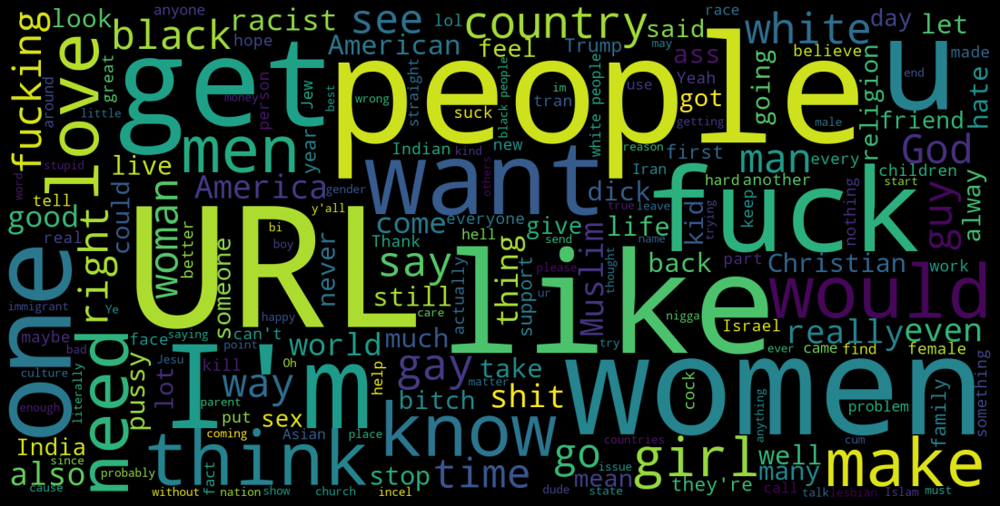

# COLX_585_BERT-Fine-Tuning-Hate-Speech-Detection

## Milestone 2

Idea : We are looking to implement a BERT based Transfer Learning Approach for Hate Speech Detection in Online Social Media

This week's milestone involved extending the idea and details about our project from the first milestone. During this week, we spent our time reading a few more research papers, understanding the data, studying about different flavours of BERT and finally implementing a few of them. We included the implementation of `FastText`, `BERTweet` and `DistilBERT` this week, and plan to implement `BERT (CNN for Fine Tuning)` and `RoBERTa` during the next one. We decided to use FastText as our baseline and compare it with the other models to see which one performs the best. We faced several challenges this week, especially in the Engineering part. However, we successfully completed the milestone with results better than we initially imagined.

### Results

In this section, we present the results obtained on our validation dataset from training the following models: 

#### FastText (baseline)

Trained for 50 epochs:

`Precision Score: 0.752`

`F1 Score: 0.565`

#### BERTweet 

Trained for 5 epochs.

`Precision: 65.778`

`Recall: 62.195`

`F1 Score: 63.936`

#### DistilBERT

Trained for 10 epochs.

```
              precision    recall  f1-score   support
           0       0.81      0.85      0.83      2665
           1       0.66      0.60      0.62      1292
    accuracy                           0.77      3957
   macro avg       0.73      0.72      0.73      3957
weighted avg       0.76      0.77      0.76      3957
```

We will update the results with the scores of `BERT (CNN for Fine Tuning)` and `RoBERTa` in the next milestone, and will attempt to improve the existing scores.

### Word Clouds 

#### All Text (With and without Hatespeech)


#### Text with Hatespeech


#### Text without Hatespeech




From the results of our EDA as shown above, we can clearly see that the text tagged as contains 'hate speech' use many abhorrent terms which the text without hatespeech don't contain. This gives an indication of the kind of data our models are trained on. This also shows that the BERT model's general vocabulary is not enough to detect hate speech in social media domain and we would need to fine tune those models wrt to specific domain data.


### See Also

Reference Paper : https://arxiv.org/pdf/1910.12574.pdf

Team Members :

- Badr Jaidi
- Oksana Kurylo
- Sneha Jhaveri
- Utkarsh Saboo
